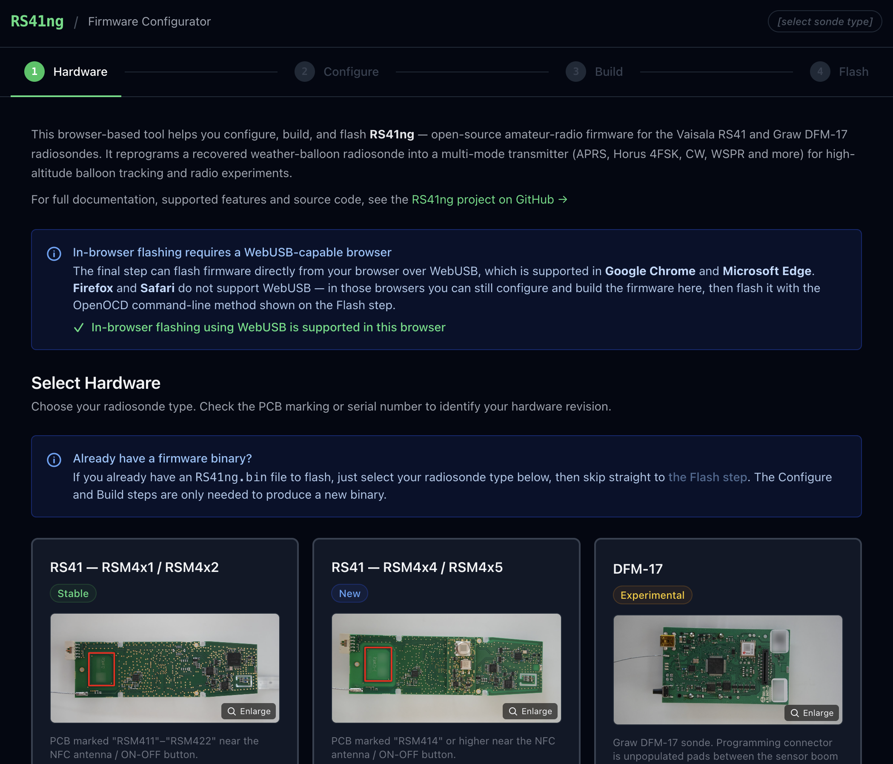
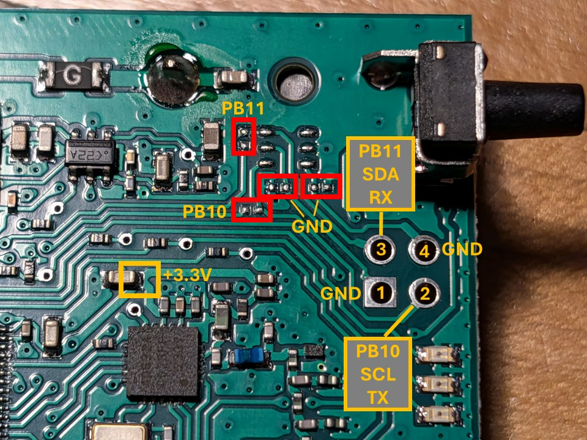
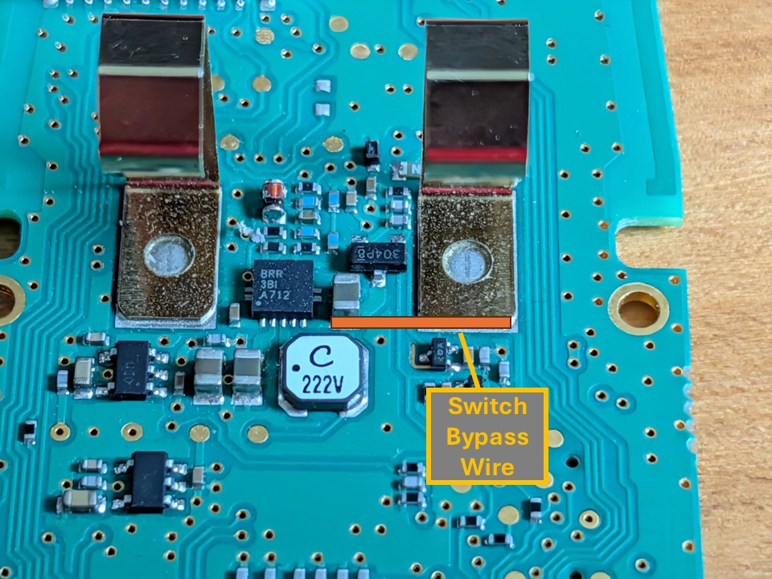

# RS41ng - Amateur radio firmware for Vaisala RS41 and Graw DFM-17 radiosondes

RS41ng supports 3 models of Radiosondes. The Vaisala RS41 4x2 and Graw DFM-17 (both based on the STM32F1 processor), and the Vaisala 4x4 (newer version based on the STM32L4 processor).

## Quickstart Guide

If you've installed RS41ng before, edit your config.h and jump down to the [Flashing the radiosonde with the Firmware](#flashing-the-radiosonde-with-the-firmware) section.

## Web Configurator (easiest way to get started)

If you are new to RS41ng, the **[web configurator](https://mikaelnousiainen.github.io/RS41ng/)** is the
recommended way to build and flash the firmware. It runs entirely in your browser — no account and no cloud
build — and guides you through four steps:

1. **Hardware** — pick your hardware (RS41 or DFM-17).
2. **Configure** — choose a preset or adjust settings through a form.
3. **Build** — download the settings file (`config.yaml`) and place it in the root of the RS41ng source directory.
   Then run the Docker build. The build automatically generates the firmware configuration from `config.yaml` settings
   and selects the correct hardware target, so you do not need to edit `config.h` or pass a `-D` flag by hand to the build command.
4. **Flash** — connect an ST-LINK v2 and flash the firmware directly from the browser over WebUSB, or use the
   OpenOCD command line as a fallback.

[](https://mikaelnousiainen.github.io/RS41ng/)

Browser-based flashing (step 3) requires a WebUSB-capable browser such as **Google Chrome** or **Microsoft
Edge**; Firefox and Safari can still be used for the configure and build steps. The configurator is a
convenience layer on top of the normal workflow — editing `config.h`/`config.c` by hand as described below
remains fully supported. See [`web/README.md`](web/README.md) for how the tool is developed and deployed.

## What is RS41ng?

RS41ng is a custom, amateur radio-oriented firmware for [Vaisala RS41](https://www.vaisala.com/en/products/weather-environmental-sensors/upper-air-radiosondes-rs41-rs41-e-models)
and [Graw DFM-17](https://www.graw.de/products/radiosondes/dfm-17/) radiosondes. These radiosonde models
have very similar hardware, so that it is relatively easy to support both with the same codebase.
It is unlikely that RS41ng could support any other radiosonde hardware for now.

Some code is based on an earlier RS41 firmware project called [RS41HUP](https://github.com/df8oe/RS41HUP),
but most of it has been rewritten from scratch. The Horus 4FSK code has been adapted from
the [darksidelemm fork of RS41HUP](https://github.com/darksidelemm/RS41HUP).

## Asking questions, filing feature requests and reporting issues

- Please use [GitHub discussions](../../discussions) for asking questions and for sharing info about your radiosonde-based projects
  - For example, questions about firmware configuration and connecting of external chips to the sonde belong here
- Please use [GitHub issues](../../issues) to file new feature requests or issues that you have already identified with the firmware
  - However, please remember to post questions about usage to [GitHub discussions](../../discussions)

## What are radiosondes and how can I get one?

Radiosondes, especially the RS41 and DFM-17, are used extensively for atmospheric sounding by the meteorological
institutes in various countries and thus easily available to be collected once they land, an activity called
radiosonde hunting: see YouTube presentation about
[Tracking and Chasing Weather Balloons by Andreas Spiess](https://www.youtube.com/watch?v=vQfztG60umI) or
[Chasing Radiosonde Weather Balloons used in Meteorology for Fun by Mark VK5QI](https://www.youtube.com/watch?v=fb9gNomWrAY)
for more details!

You can track radiosondes without any additional equipment either via [SondeHub](https://tracker.sondehub.org/) or [radiosondy.info](https://radiosondy.info/)
that both use an existing network of receiver stations. Alternatively, you can set up your own radiosonde receiver station.

For your own receiver station, you will need:

1. A cheap software-defined radio USB dongle, such as an [RTL-SDR](https://www.rtl-sdr.com/about-rtl-sdr/)
2. An antenna suitable for receiving the 400 MHz radiosonde band transmissions. Antennas for the 70 cm amateur radio band usually work fine!
3. Radiosonde tracker software: common choices are [RS41 Tracker](http://escursioni.altervista.org/Radiosonde/) for Windows
   and [radiosonde_auto_rx](https://github.com/projecthorus/radiosonde_auto_rx) for Linux / Raspberry Pi.

### What can I do with the RS41 and DFM-17 radiosondes?

The [Vaisala RS41](https://www.vaisala.com/en/products/weather-environmental-sensors/upper-air-radiosondes-rs41-rs41-e-models)
and [Graw DFM-17](https://www.graw.de/products/radiosondes/dfm-17/)
radiosondes use off-the-shelf 32-bit STM32 microcontrollers
([STM32F100-series](https://www.st.com/en/microcontrollers-microprocessors/stm32f100-value-line.html) on older RS41 and DFM-17 boards,
[STM32L412-series](https://www.st.com/en/microcontrollers-microprocessors/stm32l412cb.html) on newer RS41 RSM4x4 boards),
which can be reprogrammed using an [ST-LINK v2 programmer](https://www.st.com/en/development-tools/st-link-v2.html)
or a smaller [ST-LINK v2 USB dongle](https://www.adafruit.com/product/2548).

There is detailed information about the hardware of these radiosonde models on the following pages:

- https://github.com/bazjo/RS41_Hardware
- https://wiki.recessim.com/view/DFM-17_Radiosonde

The radiosondes can be reprogrammed to transmit different kinds of RF modulations (morse code, APRS and different FSK modulations)
on the 70 cm (~433 MHz) amateur radio band. The radiosonde contain Ublox
GPS chips, so it can be used as a tracker device, e.g. for high-altitude balloons.

The RS41ng firmware is just one example of what can be achieved with the hardware of these radiosondes!

## What are high-altitude balloon flights?

High-altitude balloon flights arranged by hobbyists are fun technical experiments.
The flight goals are usually related to aerial photography, testing of radio tracker and transmitter hardware
and different kinds of measurements with on-board sensors.

The following websites contain more information about planning and launching a high-altitude balloon flight:

- https://www.overlookhorizon.com/ - Overlook Horizon high-altitude balloon flights.
- http://www.projecthorus.org/ - Australian high-altitude balloon project. Website no longer updated.
- https://www.areg.org.au/archives/category/activities/project-horus - Newer Project Horus flights.
- https://ukhas.org.uk/ - UK high-altitude society.
- http://www.daveakerman.com/ - High-altitude balloon blog of Dave Akerman.
- https://0xfeed.tech/ - High-altitude balloon / ham radio blog of Mikael Nousiainen OH3BHX.

## Why does the RS41ng firmware exist?

The motivation to develop this firmware is to provide a clean, customizable and
modular codebase for developing radiosonde-based experiments.

See the feature list below.

## Features

The main features the RS41ng firmware are:

- Support for multiple transmission modes:
  - Standard 1200-baud and 9600-baud APRS
    - Option to transmit APRS weather reports using readings from an external BMP280/BME280 sensor (only RS41 supports custom sensors)
  - [Horus 4FSK v2 and v3 modes](https://github.com/projecthorus/horusdemodlib/wiki) that has improved performance compared to APRS or RTTY
    - There is an option to use continuous transmit mode which helps with receiver frequency synchronization and improves reception.
    - Horus V2 is deprecated. In order to use Horus V2 mode on a flight, you will need a Horus V2 payload ID. New IDs are no longer being issued. V3 simply uses your callsign and is encouraged.
  - [CATS - Communication And Telemetry System](https://cats.radio/) packet radio standard, which has a modulation much more efficient than APRS
    - The primary benefit of CATS over APRS and Horus 4FSK is that it allows for fast beacon times (1 Hz or more) without congesting the network.
    - For more details on using CATS, see the CATS website and the notes below.
  - Morse code (CW)
  - "Pip" mode, which transmits a short beep generated using CW to indicate presence of the transmitter
  - JT65/JT9/JT4/FT8/WSPR/FSQ digital modes on HF/VHF amateur radio bands using an external Si5351 clock generator connected to the external I²C bus
- Support for transmitting multiple modes consecutively with custom, rotating comment messages (see `config.c`)
- Support for GPS-based scheduling is available for transmission modes that require specific timing for transmissions
- Enhanced support for the internal Si4032 radio transmitter via PWM-based tone generation
- Extensibility to allow easy addition of new transmission modes and new sensors
- Support for custom sensors via the external I²C bus
- Support for counting pulses on expansion header (I2C2_SDA (PB11) / UART3 RX) for use with sensors like Geiger counters
- GPS NMEA data output via the external serial port (see below). RS41 only -- This disables use of I²C devices as the serial port pins are shared with the I²C bus pins.
  - This allows using the sonde GPS data in external tracker hardware, such as Raspberry Pi or other microcontrollers.
- Support for "landed mode" to increase chances of recovery days after a sonde has landed by reducing power consumption. 

### Transmission modes

On the internal Si4032 (RS41) and Si4063 (DFM-17) transmitters:

- APRS (1200 baud and 9600 baud)
- Horus 4FSK v2 and v3 (100 baud)
- CATS (9600 baud)
- Morse code (CW)
- "Pip" - a short beep to indicate presence of the transmitter
- Long Tone - continuous CW tone (useful for fox transmissions)

On an external Si5351 clock generator connected to the external I²C bus:

- Horus 4FSK v2 and v3 (50 baud, because the Si5351 frequency changes are slow)
- JT65/JT9/JT4/FT8/WSPR/FSQ mode beacon transmissions using the JTEncode library. I've decoded FT8, WSPR and FSQ modes successfully.
  - GPS-based scheduling is available for modes that require specific timing for transmissions
- Morse code (CW)
- "Pip"

#### Notes about APRS

- Bell 202 frequencies are generated via hardware PWM, but the symbol timing is created in a loop with delay
- There is also code available to use DMA transfers for symbol timing to achieve greater accuracy, but the timings are not working correctly

#### Notes about Horus 4FSK

- The Horus 4FSK modes have significantly [improved performance compared to APRS or RTTY](https://github.com/projecthorus/horusdemodlib/wiki). Horus Binary v1 has been removed from RS41ng. Support for Horus Binary v2 and v3 will continue. However, v2 is deprecated. No additional v2 IDs are being issued, in favor of using Horus Binary v3.

- There are 3 methods to decode Horus 4FSK modes:
  - Use [webhorus](https://horus.sondehub.org/), SSB audio input or an RTL-SDR,
  - Use the [horus-gui](https://github.com/projecthorus/horus-gui) application,
  - Use [horusdemodlib](https://github.com/projecthorus/horusdemodlib) on a Raspberry Pi with an RTL-SDR

#### Disabling Sondehub Upload

A `via` flag exists in the Horus Binary v3 protocol that requests for a packet to **not** be uploaded to Sondehub. This is useful if RS41ng and Horus Binary v3 are being used for asset tracking at public service events. The latest version of `horusdemodlib` supports this flag.

#### Notes about CATS

- CATS is a [modern packet radio standard](https://cats.radio/) designed for communication and telemetry. Due to its increased efficiency over APRS, it allows for fast beacon times (1 Hz or more) without congesting the network.
- To receive CATS, you can either use an [I-Gate board](https://www.tindie.com/products/hamcats/cats-i-gate-board/) on a Raspberry Pi, or just a standard RTL-SDR dongle.
  - See [the CATS I-Gate board software](https://gitlab.scd31.com/cats/igate).
  - See [the CATS SDR software](https://gitlab.scd31.com/cats/sdr-igate).
- In either case, CATS packets that are received get forwarded to FELINET, and relayed to APRS-IS. This means your CATS packets will show up on [aprs.fi](https://aprs.fi)
  - If you're relying on APRS gating, be sure to set an SSID below 100 or the APRS network may reject it.
- For more information, be sure to check [the CATS standard](https://gitlab.scd31.com/cats/cats-standard/builds/artifacts/master/file/standard.pdf?job=build).

### Fox Mode

RS41ng supports **Fox Mode**, which allows RS41ng to be used as a hidden transmitter. Fox Mode a simple mode that will disable the GPS and enable other power saving features.

Fox Mode should **not** be enabled on any radiosonde that is intended to fly, as there will be no position data collected by the GPS.

Recommended Fox Mode settings in `config.h`:

```
#define RADIO_POST_TRANSMIT_DELAY_MS 1000

#define RADIO_TX_CW true
#define RADIO_TX_CW_COUNT 1

#define RADIO_TX_LONG_TONE true
#define RADIO_TX_LONG_TONE_COUNT 5
#define RADIO_TX_LONG_TONE_DURATION_SECONDS 10

#define ENABLE_FOX_MODE true
#define ENABLE_FM_CW true
```

NOTE: See `config.c` (not `.h`) for CW string options. Many different parameters can be transmitted.

### Landed Mode

When enabled, landed mode conserves battery after the balloon has landed. It is armed when altitude exceeds the arm threshold during ascent, then requires the altitude to drop back below the arm threshold before landing detection begins (prevents false triggers during float). After landing (velocity near zero for the stationary period), the GPS and radio are put to sleep. Periodically the system wakes, acquires a fix, transmits all enabled modes once, then sleeps again. An auto-detected geofence around the landing site disables landed mode if the unit moves; it can re-enter landed mode if it settles again (with a new geofence center). 

Landed mode is recommended on launches that will not be immediately chased or if a delayed recovery is expected. Preliminary testing indicates that landed mode can allow transmissions to exceed 72 hours with Lithium AA batteries.

### External sensors

It is possible to connect external sensors to the I²C bus.

The following sensors are currently supported:

- Bosch BMP280/BME280 barometric pressure / temperature / humidity sensor
  - Note that only BME280 sensors will report humidity. For BMP280 humidity readings will be zero.
- RadSens universal dosimeter-radiometer module for measuring radiation
  - https://www.tindie.com/stores/climateguard/
  - https://github.com/climateguard/RadSens

Sensor driver code contributions are welcome!

### Planned features

- Configurable transmission frequencies and schedules based on location / altitude
- Support for more I²C sensors
- RTTY on both Si4032/Si4063 (70 cm, non-standard shift) and Si5351 (HF + 2m) with configurable shift
- Investigate possibility to implement 1200 bps Bell 202 modulation (and
  possibly also 300 bps Bell 103 modulation) for APRS using Si5351,
  this requires special handling to make Si5351 change frequency quickly
  - See: https://github.com/etherkit/Si5351Arduino/issues/22

## Configuring the firmware

> **Tip:** The [web configurator](https://mikaelnousiainen.github.io/RS41ng/) can generate the configuration
> for you as a `config.yaml` file — see [Web Configurator](#web-configurator-easiest-way-to-get-started). The
> instructions below describe configuring the firmware manually by editing `config.h` and `config.c`.

1. Configure your amateur radio call sign, transmission schedule (time sync),
   transmit frequencies and transmission mode parameters in `config.h`
   - NOTE: Selecting the radiosonde type is not necessary with the compiler options ("-DDFM17=1", "-DRS41=1", or "-DRS41_RSM4X4=1").
   - Customize at least the following settings:
     - `CALLSIGN`
     - Settings beginning with `RADIO_` to select transmit power and the modes to transmit
     - At least `APRS_SSID`, `APRS_SYMBOL` and `APRS_COMMENT` if you transmit APRS
     - At least `CATS_SSID`, `CATS_ICON` and `CATS_COMMENT` if you transmit CATS
2. Set up transmitted message templates in `config.c`, depending on the modes you use.
   You can customize the APRS, CATS and CW messages in more detail here.

### Power consumption and power-saving features

Power consumption notes (at 3V supply voltage) for RS41 by Mark VK5QI:

- GPS in full power acquisition mode: 110-120 mA (TX off), 160-170 mA (TX on)
- GPS locked (5 sats), full power: 96 - 126 mA (TX off), 170 mA (TX on)
- GPS locked, powersave mode, state 1: ~96 - 110 mA (TX off), ?
- GPS locked, powersave mode, state 2: 60 - 90mA (TX off), 130 mA (TX on)

The variations seem to be the GPS powering up every second to do its fixes.

### Time sync settings

The time sync feature is a simple way to activate the transmissions every N seconds, delayed by the `TIME_SYNC_OFFSET_SECONDS` setting.

Please note that the time sync requires a stable GPS signal (good visibility to the sky) to work correctly!

#### Time-slotted modes

For time-slotted modes like FT8 and WSPR, the default configuration file (`config.h`) already contains useful defaults.

##### FT8 example

The default FT8 configuration is:

```
#define FT8_TIME_SYNC_SECONDS 15
#define FT8_TIME_SYNC_OFFSET_SECONDS 1
```

The above means that transmissions should start every 15 seconds (counting from the beginning of each hour),
but delayed by 1 second. As an example, transmissions after 12:00:00 (hh:mm:ss) would happen at
12:00:01, 12:00:16, 12:00:31; 12:00:46, 12:01:01 and so on.

The offset of 1 second is just to make sure the transmission starts strictly after the 15-second periods and never before.

If the offset was 5 seconds, transmissions would happen at 12:00:05, 12:00:20, 12:00:35, 12:00:50 and 12:01:05.

In order to transmit only in even or odd time slots of FT8, you could use:

```
// Transmit every 30 seconds, even time slot
#define FT8_TIME_SYNC_SECONDS 30
#define FT8_TIME_SYNC_OFFSET_SECONDS 1
```

```
// Transmit every 30 seconds, odd time slot
#define FT8_TIME_SYNC_SECONDS 30
#define FT8_TIME_SYNC_OFFSET_SECONDS 16
```

The latter (odd time slot) example would transmit at 12:00:16, 12:00:46, 12:01:16, 12:01:46 and so on.

##### WSPR example

For WSPR, the transmissions happen every 120 seconds, so the configuration has to be:

```
#define WSPR_TIME_SYNC_SECONDS 120
#define WSPR_TIME_SYNC_OFFSET_SECONDS 1
```

The above means that transmissions should start every 120 seconds (counting from the beginning of each hour),
but delayed by 1 second. As an example, transmissions after 12:00:00 (hh:mm:ss) would happen at
12:00:01, 12:02:01, 12:04:01 and so on.

The offset of 1 second is just to make sure the transmission starts strictly after the 120-second periods and never before.

#### Manually configuring time slots for multiple payloads transmitting at different times

Sometimes it is necessary to set transmission time slots when using multiple payloads/transmitters on the same frequency.
The time slots guarantee that the transmissions from different payloads will not happen simultaneously.

The time sync settings can be used to configure this type of time slots.

In this example, we configure 3 payloads to transmit every 120 seconds, so that each payload is scheduled to transmit
evenly across the 120-second period, every 40 seconds (120 / 3 = 40).

First, the `TIME_SYNC_SECONDS` setting of the particular mode has to be set to the _full interval where all payloads are expected to have their transmissions finished_.
This setting has to be the same for every payload. Do also remember to take into account transmission length too (depending on the mode).

Next, the `TIME_SYNC_OFFSET_SECONDS` needs to be set independently for each payload. The first payload would have
an offset of 0, the second an offset of 40 and the third and offset of 80.

As an example, transmissions after 12:00:00 (hh:mm:ss) would happen at:

- Payload 1: 12:00:00
- Payload 2: 12:00:40
- Payload 3: 12:01:20
- Payload 1: 12:02:00
- Payload 2: 12:02:40
- Payload 3: 12:03:20
- ...

The configuration with 3 payloads using Horus 4FSK V2 mode would be the following.

Payload 1:

```
#define HORUS_V2_TIME_SYNC_SECONDS 120 // everything happens at 120 seconds interval
#define HORUS_V2_TIME_SYNC_OFFSET_SECONDS 0 // the first payload will transmit at 0 seconds within the 120 second interval
```

Payload 2:

```
#define HORUS_V2_TIME_SYNC_SECONDS 120 // everything happens at 120 seconds interval
#define HORUS_V2_TIME_SYNC_OFFSET_SECONDS 40 // the second payload will transmit at 40 seconds within the 120 second interval
```

Payload 3:

```
#define HORUS_V2_TIME_SYNC_SECONDS 120 // everything happens at 120 seconds interval
#define HORUS_V2_TIME_SYNC_OFFSET_SECONDS 80 // the third payload will transmit at 80 seconds within the 120 second interval
```

## Building the firmware

The easiest and the recommended method to build the firmware is using Docker.

If you have a Linux environment -- Windows Subsystem for Linux (WSL) or macOS might work too -- and
you feel adventurous, you can try to build using the Linux-based instructions.

### Building the firmware with Docker

Using Docker to build the firmware is usually the easiest option, because it provides a stable Fedora Linux-based
build environment on any platform. It should work on Windows and Mac operating systems too.

The Docker environment can also help address issues with the build process.

1. Install Docker if not already installed
2. Set the current directory to the RS41ng source directory
3. Build the RS41ng compiler Docker image using the following command. It is necessary to build the Docker image only once.
   ```
   docker build -t rs41ng_compiler .
   ```
4. Build the firmware using the helper script. If you need to rebuild the firmware, simply run it again.
   On Linux/macOS, run:
   ```
   ./build-firmware.sh
   ```
   On Windows, run:
   ```
   build-firmware.bat
   ```
   The script wraps the Docker build command and selects the configuration to build (see below).
5. The firmware will be stored in file `build/src/RS41ng.elf` for manually flashing with OpenOCD or
in `build/RS41ng.bin` for flashing using the web configurator.

**Using a `config.yaml` from the web configurator:** if a `config.yaml` file is present in the source
directory root, the build automatically generates `config_generated.h` / `config_generated.c` from it
and derives the hardware target from the `hardware.type` field, so you do not need to specify a target flag.
The generated files are temporary and removed after the build. See
[`config.yaml.example`](config.yaml.example) for the file format.

You can build from a **different configuration file** by passing it as the first argument (it must be located
in the source directory root):

```
./build-firmware.sh my-tracker.yaml         # Linux/macOS
build-firmware.bat my-tracker.yaml          # Windows
```

**Building without a `config.yaml`:** if no configuration file is present, the build uses your hand-edited
`config.h` / `config.c` and you **must** pass a target flag: `-DRS41=1`, `-DRS41_RSM4X4=1`, or `-DDFM17=1`.
Any arguments after the (optional) config file are forwarded to CMake:

```
./build-firmware.sh -DRS41_RSM4X4=1         # Linux/macOS
build-firmware.bat -DRS41_RSM4X4=1          # Windows
```

Replace `-DRS41_RSM4X4=1` with `-DRS41=1` or `-DDFM17=1` as appropriate for your hardware.

> The scripts run `docker run --rm -it -v $(pwd):/usr/local/src/RS41ng -e CONFIG_FILE=... rs41ng_compiler`
> for you. The container runs `docker_build.sh` from the mounted source tree, so edits to it take effect
> without rebuilding the image.

Now you can flash the firmware using instructions below (skip the build instructions for Linux).

### Building the firmware in a Linux environment

Software requirements:

- [GNU GCC toolchain](https://developer.arm.com/downloads/-/gnu-rm)
  for cross-compiling the firmware for the ARM Cortex-M3 architecture (`arm-none-eabi-gcc`)
  - Pick the latest toolchain version available for your operating system.
- [CMake](https://cmake.org/) version 3.13 or higher for building the firmware
- [OpenOCD](http://openocd.org/) version 0.10.0 or higher for flashing the firmware

On a Red Hat/Fedora Linux installation, the following packages can be installed:

```bash
dnf install arm-none-eabi-gcc-cs arm-none-eabi-gcc-cs-c++ arm-none-eabi-binutils-cs arm-none-eabi-newlib cmake openocd
```

#### Steps to build the firmware on Linux

1. Install the required software dependencies listed above
2. Build the firmware using the following commands. You **must** specify a target flag: `-DRS41=1`, `-DRS41_RSM4X4=1`, or `-DDFM17=1`.
   ```
   mkdir build
   cd build
   cmake -DCMAKE_TOOLCHAIN_FILE=../cmake/arm-none-eabi-gcc.cmake -DRS41=1 ..
   make
   ```
   Replace `-DRS41=1` with `-DRS41_RSM4X4=1` or `-DDFM17=1` as appropriate for your hardware.
3. The firmware will be stored in file `build/src/RS41ng.elf` for manually flashing with OpenOCD or
in `build/RS41ng.bin` for flashing using the web configurator.

## Prepare the radiosonde for flashing the firmware

Hardware requirements:

- A working [Vaisala RS41](https://www.vaisala.com/en/products/instruments-sensors-and-other-measurement-devices/soundings-products/rs41)
  or [Graw DFM-17](https://www.graw.de/products/radiosondes/dfm-17/) radiosonde :)
- An [ST-LINK v2 programmer for the STM32 microcontroller](https://www.st.com/en/development-tools/st-link-v2.html) in the RS41 radiosonde.
  - These smaller [ST-LINK v2 USB dongles](https://www.adafruit.com/product/2548) also work well.
  - [Partco sells the ST-LINK v2 USB dongles in Finland](https://www.partco.fi/en/measurement/debugging/20140-stlinkv2.html)

Follow the instructions below for the radiosonde model you have.

### Vaisala RS41 programming connector

The pinout of the RS41 programming connector (by DF8OE and VK5QI) is the following:

```
______________________|           |______________________
|                                                       |
|   9           7           5           3           1   |
|                                                       |
|   10          8           6           4           2   |
|_______________________________________________________|

(View from the bottom of the sonde, pay attention to the gap in the connector)
```

- 1 - GND
- 2 - I2C2_SDA (PB11) / UART3 RX
  - This is the external I²C port data pin for Si5351 and sensors
  - This pin can be used as input for the pulse counter.
- 3 - I2C2_SCL (PB10) / UART3 TX
  - This is the external I²C port clock pin for Si5351 and sensors
  - This pin can alternatively be used to output GPS NMEA data to external tracker hardware (e.g. Raspberry Pi or other microcontrollers)
- 4 - +VDD_MCU / PB1 \* (10k + cap + 10k)
- 5 - MCU switched 3.3V out to external device / Vcc (Boost out) 5.0V
  - This pin powers the device via 3.3V voltage from an ST-LINK programmer dongle
  - This pin can be used to supply power to external devices, e.g. Si5351, BMP280 or other sensors
- 6 - +U_Battery / VBAT 3.3V
- 7 - RST
- 8 - SWCLK (PA14)
- 9 - SWDIO (PA13)
- 10 - GND

#### Connect the RS41 radiosonde to the programmer

1. If your ST-LINK v2 programmer is capable of providing a voltage of 3.3V (as some third-party clones are),
   remove the batteries from the sonde. Otherwise, leave the batteries in and power on the sonde.
2. Connect an ST-LINK v2 programmer dongle to the sonde via the following pins:

- SWDIO -> Pin 9 (SWDIO)
- SWCLK -> Pin 8 (SWCLK)
- GND -> Pin 1 (GND)
- 3.3V -> Pin 5 (MCU switch 3.3V) (only required when using the programmer to power the sonde)

### Graw DFM-17 programming and I²C connector

The DFM-17 programming connector is an unpopulated group of pads on the circuit board
between the sensor boom connector and the main STM32 microcontroller.

The pinout of the DFM-17 programming connector is the following:

```
_____
|   |
| S |       _____________________
| e |       |                   |
| n |       |   1           2   |
| s |       |                   |
| o |       |   3           4   |             ________________________
| r |       |                   |             |
|   |       |   5           6   |             | STM32 microcontroller
| b |       |                   |             |
| o |       |   7           8   |             |
| o |       |                   |             |
| m |       |   9          10   |             |
|   |       |                   |             |
|   |       |____________________             |
|   |
|___|

(The sensor boom connector is on the left and the main microcontroller unit on the right side)
```

- 1 - VTRef
  - This pin powers the device via 3.3V voltage from an ST-LINK programmer dongle
- 2 - SWDIO / TMS
- 3 - GND
- 4 - SWCLK / TCK
- 5 - GND
- 6 - SWO EXT TRACECTL / TDO
- 7 - KEY
- 8 - NC EXT / TDI
- 9 - GNDDetect
- 10 - nRESET

To enable external I²C, UART, or pulse counter access on the DFM17 radiosonde, some small pads must be shorted on the PCB with a very small wire or solder blob. At a minimum, the pads shown as PB10 and PB11 must be shorted. Optionally the pads shown as GND can be shorted if you wish to connect header pins 1 and 4 to ground. For full functionality, short all of the pads in each red box.

+3.3V can be picked off the pin of the capacitor shown in the yellow box.



#### Connect the DFM-17 radiosonde to the programmer

1. Since the DFM-17 programming connector is just an unpopulated group of pads on the circuit board,
   **you will need to either solder wires directly to the pads or alternatively solder a 0.05" (1.27mm) 5-by-2 pin header to the pads**.
   There are suitable ribbon cables with 5x2 0.05" connectors available for this type of pin header.
2. Connect an ST-LINK v2 programmer dongle to the sonde via the following pins:
   - SWDIO -> Pin 2 (SWDIO)
   - SWCLK -> Pin 4 (SWCLK)
   - RST -> Pin 10 (RST)
   - GND -> Pin 5 (GND)
   - 3.3V -> Pin 1 (VTRef) (only required when using the programmer to power the sonde)
3. If your ST-LINK v2 programmer is capable of providing a voltage of 3.3V (as some third-party clones are),
   remove the batteries from the sonde. Otherwise, leave the batteries in and power on the sonde.

## Flashing the radiosonde with the firmware

### STM32F1-based boards (older RS41 and DFM-17)

1. Unlock the flash protection - needed only before reprogramming the sonde for the first time
   - `openocd -f interface/stlink.cfg -f target/stm32f1x.cfg -c "init; halt; flash protect 0 0 63 off; exit"`
   - **NOTE:** If the above command fails with an error about erasing sectors, try replacing the number `63` with either `31` or the number the error message suggests:
     - `openocd -f interface/stlink.cfg -f target/stm32f1x.cfg -c "init; halt; flash protect 0 0 31 off; exit"`
2. Flash the firmware
   - `openocd -f interface/stlink.cfg -f target/stm32f1x.cfg -c "program build/src/RS41ng.elf verify reset exit"`
3. Power cycle the sonde to start running the new firmware

### STM32L4-based boards (newer RS41 RSM4x4)

1. Unlock the flash protection - needed only before reprogramming the sonde for the first time
   1. Issue unlock flash command:
      - `openocd -f interface/stlink.cfg -f target/stm32l4x.cfg -c "init; reset halt; stm32l4x unlock 0; reset halt; exit"`
   2. There should be a message that includes `Info : RDP level 1 (0x00)`. This verifies that some protections were enabled.
   3. **Disconnect the RS41**. Remove batteries if present. Allow 30 seconds for capacitors to discharge. Fidgeting with the power switch may expedite this step.
   4. **Reconnect the RS41**.
   5. Disable additional protections:
      - `openocd -f interface/stlink.cfg -f target/stm32l4x.cfg -c "init; reset halt; flash protect 0 0 last off; exit"`
   6. We NOW expect to see the message `Info : RDP level 0 (0xAA)`. This means the board was unlocked by the first command. If this message is not present, repeat the previous steps.
   7. **Disconnect the RS41**. Remove batteries if present. Allow 30 seconds for capacitors to discharge. Fidgeting with the power switch may expedite this step.
   8. **Reconnect the RS41**. Normal flashing should now work. If flashing does not work, repeat the unlock process.
2. Flash the firmware
   - `openocd -f interface/stlink.cfg -f target/stm32l4x.cfg -c "program build/src/RS41ng.elf verify reset exit"`
3. Power cycle the sonde to start running the new firmware

## Developing / debugging the firmware

It is possible to receive log messages from the firmware program and to perform debugging of the firmware using GNU GDB.

Also, please note that Red Hat/Fedora do not provide GDB for ARM architectures, so you will need to manually download
and install GDB from [ARM GNU GCC toolchain](https://developer.arm.com/downloads/-/gnu-rm).
Pick the latest version available for your operating system.

Semihosting allows the firmware to send log messages via special system calls to OpenOCD, so that you
can get real-time feedback and debug output from the application.

**Semihosting has to be disabled when the RS41 radiosonde is not connected to the STM32 programmer dongle,
otherwise the firmware will not run.**

### Steps to start firmware debugging and semihosting

1. Connect the RS41 radiosonde to a computer via the STM32 ST-LINK programmer dongle
2. Enable semihosting and logging in `config.h` by uncommenting the following lines
    ```
    #define SEMIHOSTING_ENABLE
    #define LOGGING_ENABLE
    ```
3. Start OpenOCD and leave it running in the background
    ```
    openocd -f interface/stlink.cfg -f target/stm32f1x.cfg
    ```
4. Start ARM GDB
    ```
    arm-none-eabi-gdb
    ```
5. Connect GDB to OpenOCD for flashing and debugging (assumes you are in the `build` directory with Makefiles from CMake ready for build)
    ```
    target remote localhost:3333
    monitor arm semihosting enable
    make
    load src/RS41ng.elf
    monitor reset halt
    continue # this command runs the firmware
    ```
6. OpenOCD will output log messages from the firmware and GDB can be used to interrupt
   and inspect the firmware program.

To load debugging symbols for settings breakpoints and to perform more detailed inspection,
use command `file src/RS41ng.elf`.

NOTE: To save RAM, the heap size has been zeroed out. Dynamic memory allocations (`malloc`, etc.) will not function. Use static or stack-based allocation if needed.

## Hardware-specific Notes

This section is allocated for documentation of various features and oddities of specific radiosonde types.

### Graw DFM-17 GPS Disciplined Oscillator

RS41ng uses the PPS output of the onboard GPS to trim the oscillator for the radio IC (Si4063). This is possible due to a clock output from the Si4063 (a GPIO pin) being connected the oscillator input pin on the STM32F1. This input uses the HSE_BYPASS feature of the STM32F1. On the STM32F1, a timer is configured to count ticks at a rate of 1,000,000 ticks per second. Each PPS interrupt from the GPS triggers a function to compare the actual number of ticks versus the expected number of ticks (1,000,000). This delta in timing, measured in parts-per-million, is fed to a "perturb and observe" algorithm that makes adjustments to the clock trimming capacitors on the Si4063 radio IC. The perturb-and-observe algorithm was chosen over a standard PLL method due to the non-linear behavior of the clock trimming. 

The realized impact of this feature is that a DFM-17 can be wholly GPS disciplined and maintain frequency stability over a wide range of temperatures. 

NOTE: Obtaining a GPS lock that produces PPS output can take a few minutes, and the algorithm can take approximately 15 minutes to stabilize after power-on in a clear sky environment. The DFM-17 is ready for flight when the GPS has a solid lock, but frequency stability may not be achieved until the perturb-and-observe algorithm has locked as well. See state 3 below. 

If the `TX_DFM_ADDITIONAL_TELEM` feature is enabled in `config.h`, specific values from this P&O loop are transmitted as telemetry on Horus Binary v3. They will be conveyed as:
* `Cal x 0` -> The absolute value of the clock trimming register (defaults to 98 or 0x62)
* `Cal x 1` -> The capacitance trim offset -- how many steps away from the default value
* `Cal x 2` -> Microsecond delta from PPS to onboard clock. `0` means the PPS and onboard clock are in sync. Positive numbers imply the onboard clock is running slow. Negative numbers imply the onboard clock is running fast. 
* `Cal x 3` -> Perturn-and-observe loop state:
  * 0 - PO_STARTUP - Collecting initial baseline measurement
  * 1 - PO_SETTLING - Waiting for a step to take effect on hardware
  * 2 - PO_OBSERVING - Collecting post-step error samples
  * 3 - PO_LOCKED - Error within dead band, monitoring for drift

### RS41 RSM4x4/RSM4x5 Notes

The RSM4x4/RSM4x5 revisions of the RS41 have some features that should be noted:
* GPS PPS is connected to PB6.
* The U-Blox M10050 (marked rev A0102A) does NOT support PSMCT. Despite many hours spent testing, the power save mode state would never go beyond `acquiring`. 

### RS41 Switch Bypass

A wire can be soldered from the positive battery terminal to a decoupling capacitor on the power supply circuit that bypasses the onboard power switch and power switching circuitry. This applies to two use cases: single-cell battery operation (typically functional down to 0.7V), and to prevent landing impact from turning off the RS41 if the batteries lose contact in the battery holder. 

The location of the wire is shown in orange:



## Si4032 Bell FSK modulation hack for APRS

Notes by Mikael OH3BHX:

The idea behind the APRS / Bell 202 modulation implementation is based on RS41HUP project and its "ancestors"
and I'm describing it here, since it has not been documented elsewhere.

The Si4032 chip seems to support only a very specific type of FSK, where one can define two frequencies
(on a 625 Hz granularity) that can be toggled by a register change. Because of the granularity, this mechanism cannot be directly
used to generate Bell 202 tones.

The way Bell 202 AFSK is implemented for Si4032 is kind of a hack, where the code toggles these two frequencies at
a rate of 1200 and 2200 Hz, which produces the two Bell 202 tones even though the actual frequencies are something else.

Additionally, the timing of 1200/2200 Hz was done in RS41HUP by using experimentally determined delays
and by disabling all interrupts, so they won't interfere with the timings.

I have attempted to implement Bell 202 frequency generation using hardware DMA and PWM, but have failed to generate
correct symbol rate that other APRS equipment are able to decode. I have tried to decode the DMA-based modulation with
some tools intended for debugging APRS and while some bytes are decoded correctly every once in a while,
the timings are mostly off for some unknown reason.

Currently, the Bell 202 modulation implementation uses hardware PWM to generate the individual tone frequencies,
but the symbol timing is created in a loop with delay that was chosen carefully via experiments.

## Debugging APRS

Here are some tools and command-line examples to receive and debug APRS messages using an
SDR receiver. There are examples for using both [rx_tools](https://github.com/rxseger/rx_tools)
and [rtl-sdr](https://github.com/osmocom/rtl-sdr) tools to interface with the SDR receiver.
The example commands assume you are using an RTL-SDR dongle, but `rx_fm` (from `rx_tools`)
supports other types of devices too, as it's based on SoapySDR.

### Dire Wolf

[Dire Wolf](https://github.com/wb2osz/direwolf) can decode APRS (and lots of other digital modes)
from audio streams.

rx_tools:

```bash
rx_fm -f 432500000 -M fm -s 250000 -r 48000 -g 22 -d driver=rtlsdr - | direwolf -n 1 -D 1 -r 48000 -b 16 -
```

rtl-sdr:

```bash
rtl_fm -f 432500000 -M fm -s 250k -r 48000 -g 22 - | direwolf -n 1 -D 1 -r 48000 -b 16 -
```

### SigPlay

[SigPlay](https://bk.gnarf.org/creativity/sigplay/) is a set of tools for DSP and signal processing.
SigPlay also includes a command-line tool to decode and print out raw data from Bell 202 encoding,
which is really useful, as it allows you to see the bytes that actually get transmitted --
even if the packet is not a valid APRS packet!

rx_tools:

```bash
rx_fm -f 432500000 -M fm -s 250000 -r 48000 -g 22 -d driver=rtlsdr - | ./aprs -
```

rtl-sdr:

```bash
rtl_fm -f 432500000 -M fm -s 250k -r 48000 -g 22 - | ./aprs -
```

# Authors

* Mikael Nousiainen OH3BHX <mikael@0xfeed.tech>
* Mike Hojnowski KD2EAT contributed significantly to Graw DFM-17 and RSM4x4 support and testing
* Andrew Koenig KE5GDB added support for RSM4x4 boards and implemented significant new features in the firmware
* Stephen D (https://www.scd31.com/) implemented CATS support with help from Andrew KE5GDB
* Various authors with smaller contributions from GitHub pull requests
* Original codebase: DF8OE and other authors of the [RS41HUP](https://github.com/df8oe/RS41HUP) project
* Horus 4FSK code adapted from [darksidelemm fork of RS41HUP](https://github.com/darksidelemm/RS41HUP) project
* CATS code adapted from [CATS reference implementation](https://gitlab.scd31.com/cats/ham-cats/)
  * LDPC encoder adapted from [libCATS](https://github.com/CamK06/libCATS)

# Additional documentation

## Vaisala RS41 hardware documentation

* https://github.com/bazjo/RS41_Hardware - Reverse-engineered documentation on the RS41 hardware
* https://github.com/bazjo/RS41_Decoding - Information about decoding the RS41 data transmission
* http://happysat.nl/RS-41/RS41.html - Vaisala RS-41 SGP Modification and info about the original firmware settings
* https://destevez.net/2018/06/flashing-a-vaisala-rs41-radiosonde/
* https://destevez.net/2017/11/tracking-an-rs41-sgp-radiosonde-and-reporting-to-aprs/
* https://github.com/digiampietro/esp8266-rs41 - A tool for reconfiguring RS41s via its serial port

## Vaisala RS41 hardware datasheets

### RSM4x4/RSM4x5 hardware revision (newer, e.g. RSM424/RSM425)

* STMicroelectronics STM32L412xx microcontroller datasheet: https://www.st.com/resource/en/datasheet/stm32l412rb.pdf
  * Part number: STM32L412RBT6 with LQFP64 packaging and 128kB flash memory
  * Manufacturer website: https://www.st.com/en/microcontrollers-microprocessors/stm32l412rb.html
* ublox UBX-M10050-KB GPS receiver datasheet: https://www.u-blox.com/en/product/ubx-m10050-chip
  * Manufacturer website: https://www.u-blox.com/en/product/ubx-m10050-chip

### RSM4x2/RSM4x1 hardware revision (older, e.g. RSM412, RSM411, RSM421, RSM422)

* STM32F100x8 microcontroller datasheet: https://www.st.com/resource/en/datasheet/stm32f100cb.pdf
  * Part number: STM32F100C8T6B with LQFP48 packaging and 64kB flash memory
  * Manufacturer website: https://www.st.com/en/microcontrollers-microprocessors/stm32f100c8.html
* u-blox UBX-G6010-ST GPS receiver datasheet: https://www.u-blox.com/sites/default/files/products/documents/UBX-G6010-ST_ProductSummary_%28GPS.G6-HW-09001%29.pdf
  * Manufacturer website: https://www.u-blox.com/en/product/ubx-g6010-st-chip
  * The GPS chip has reached end-of-life status

### Common hardware components

* Si4032 datasheet: https://www.silabs.com/documents/public/data-sheets/Si4030-31-32.pdf
* Si4030/31/32 Register Descriptions: https://www.silabs.com/documents/public/application-notes/AN466.pdf

## Graw DFM-17 hardware documentation

* https://wiki.recessim.com/view/DFM-17_Radiosonde - Reverse-engineered documentation on the DFM-17 hardware

## Graw DFM-17 hardware datasheets

* STM32F100x8 datasheet: https://www.st.com/resource/en/datasheet/stm32f100cb.pdf
* Si4063 datasheet: https://www.silabs.com/documents/public/data-sheets/Si4063-60-C.pdf
* Programming Guide for EZRadioPRO Si4x6x Devices: https://www.silabs.com/documents/public/application-notes/AN633.pdf
* Si4x6x API Documentation: http://www.silabs.com/documents/public/application-notes/EZRadioPRO_REVC2_API.zip

## Alternative RS41 firmware projects (only for RS41!)

* https://github.com/Nevvman18/rs41-nfw - RS41-NFW - An alternative to RS41ng for supporting new RS41 PCB revisions and some of the built-in sensors
* https://github.com/df8oe/RS41HUP - The original amateur radio firmware for RS41
* https://github.com/darksidelemm/RS41HUP - A fork of the original firmware that includes support for Horus 4FSK (but omits APRS)
* https://github.com/darksidelemm/RS41FOX - RS41-FOX - RS41 Amateur Radio Direction Finding (Foxhunting) Beacon
* http://www.om3bc.com/docs/rs41/rs41_en.html
